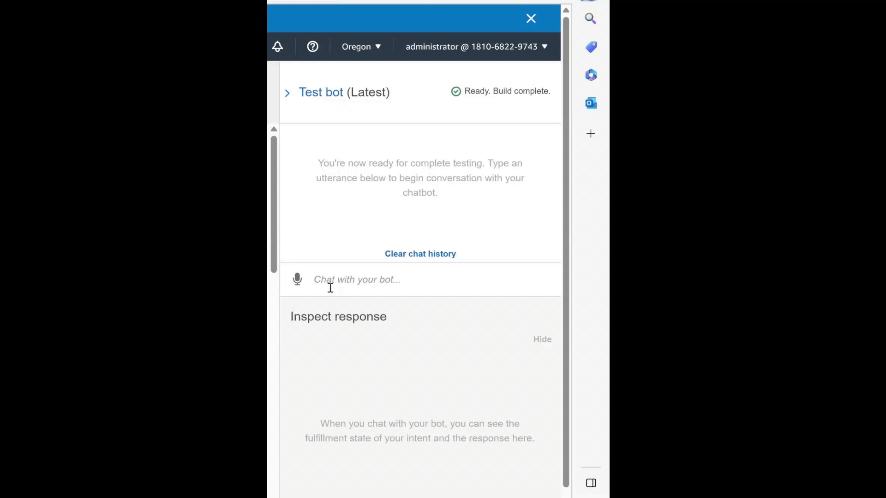

# AI Retirement Robo Advisor

In this project, we will leverage the power of Amazon Web Services (AWS), Python, and AI-driven technologies to create an intelligent robo advisor aimed at recommending personalized investment portfolios for retirement planning. 

Project Deliverables:

-**Lambda Function Script**: A Python script containing the final Lambda function code that validates user inputs, processes data, and generates personalized retirement investment portfolio recommendations.

- **Demo Videos or GIFs**:
  - **Demo of Robo Advisor Interaction**: A short video demonstrating the user's interaction with the robo advisor through the "Test bot" pane. Showcase how the bot engages in a conversation to gather requirements and provide investment recommendations.
     
  - **Demo of Lambda Function Integration**: Another video or GIF illustrating the integration of the Amazon Lambda function with the bot. Highlight the seamless flow of data between the bot and the Lambda function, resulting in accurate and personalized investment advice.
  
